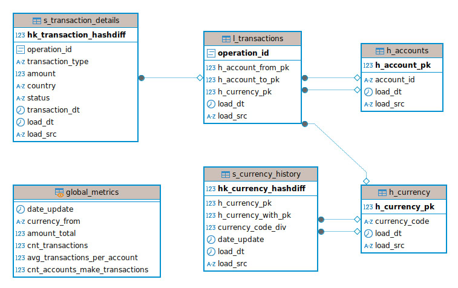
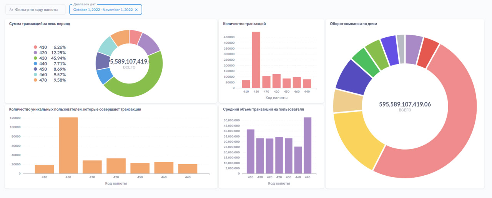

# Итоговый проект

### Описание
Репозиторий предназначен для сдачи итогового проекта.

Проект реализует пайплайн обработки данных. Выгрузка данных из **S3** в DWH с помощью DAG в **Airflow**: обработка информации в рамках ETL-процесса. Хранилище реализовано на **Vertica**. Дашборд реализованна на **Metabase**.

### Загрузка данных

Данные выгружены батчами: необходимо обрабатывать каждый файл итеративно при запуске ETL-процесса. История изменения курсов валют лежит в `currencies_history.csv`, а история транзакций — в батчах `transactions_batch_*.csv`.\
Данные по транзакциям `transactions_batch_*.csv` отсортированы по времени с 01.10.2022 и далее, при этом разбиты по возрастающим батчам на 10 частей.

Подключение к данным в S3 осуществляется через библиотеку `boto3`.

### Модель хранилища

Построенна модель хранилища данных **Data Vault**

### Витрина данных

Реализованна витрина `global_metrics` с агрегацией по дням.
Витрину имеет следующие поля:\
`date_update` — дата расчёта,\
`currency_from` — код валюты транзакции;\
`amount_total` — общая сумма транзакций по валюте в долларах;\
`cnt_transactions` — общий объём транзакций по валюте;\
`avg_transactions_per_account` — средний объём транзакций с аккаунта;\
`cnt_accounts_make_transactions` — количество уникальных аккаунтов с совершёнными транзакциями по валюте.

# Дашборд, построенный на основе витрины.

### Структура репозитория

Внутри `src` расположены папки:
- `/src/dags` - папка кода DAG, который поставляет данные из источника в хранилище.
- `/src/sql` - SQL-запрос формирования таблиц в `STAGING`- и `DWH`-слоях, а также скрипт подготовки данных для итоговой витрины.
- `/src/img` - скриншот реализованного над витриной дашборда и модели данных.
